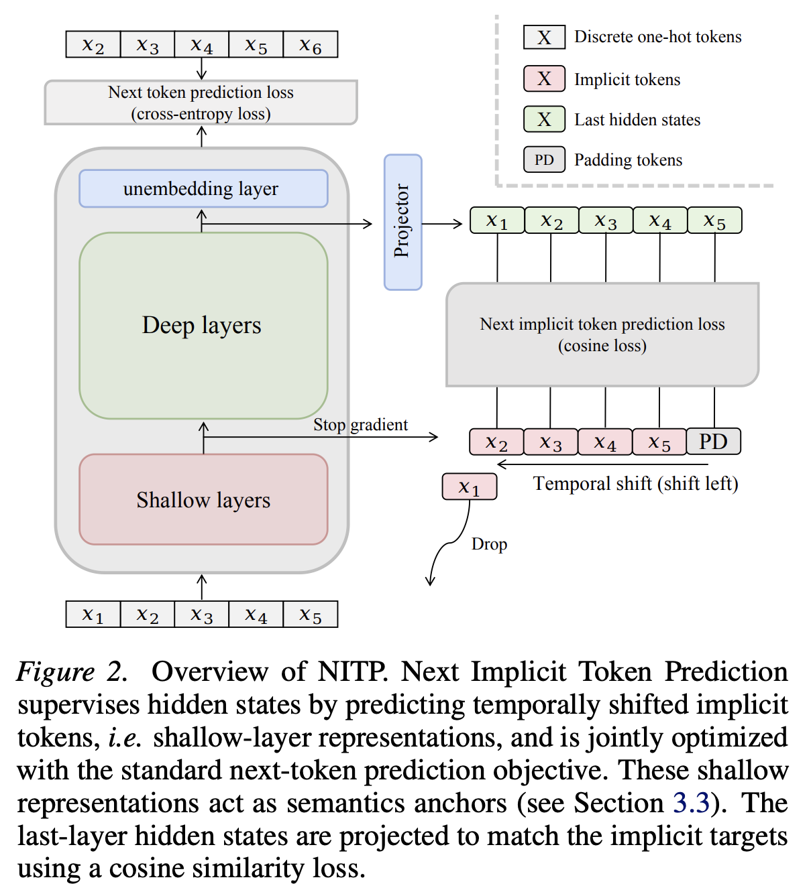
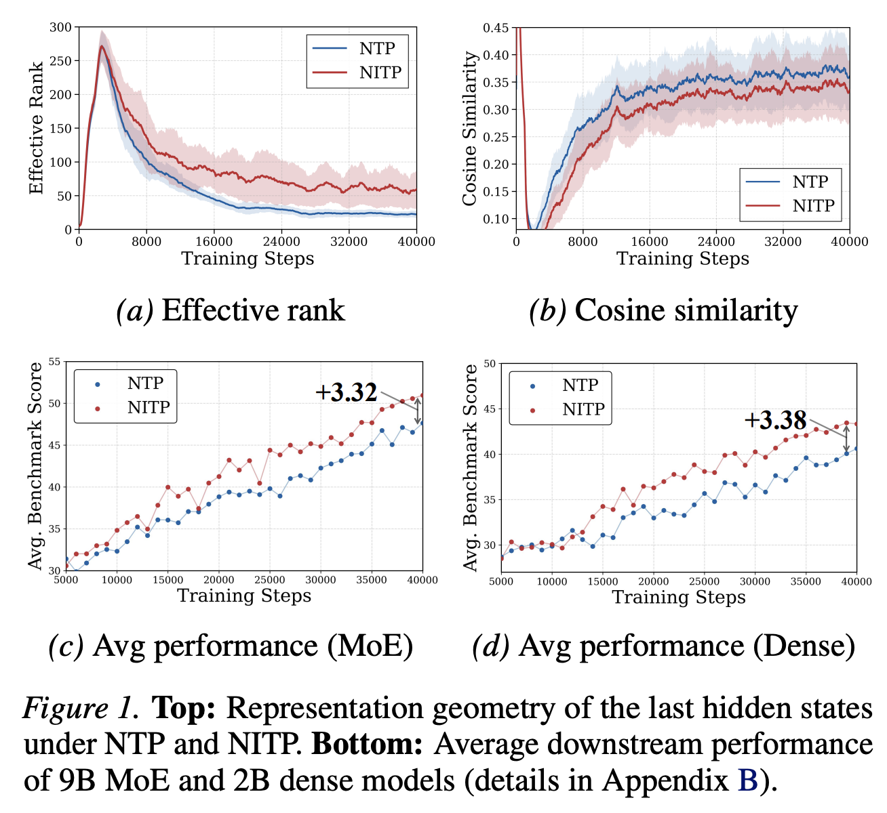
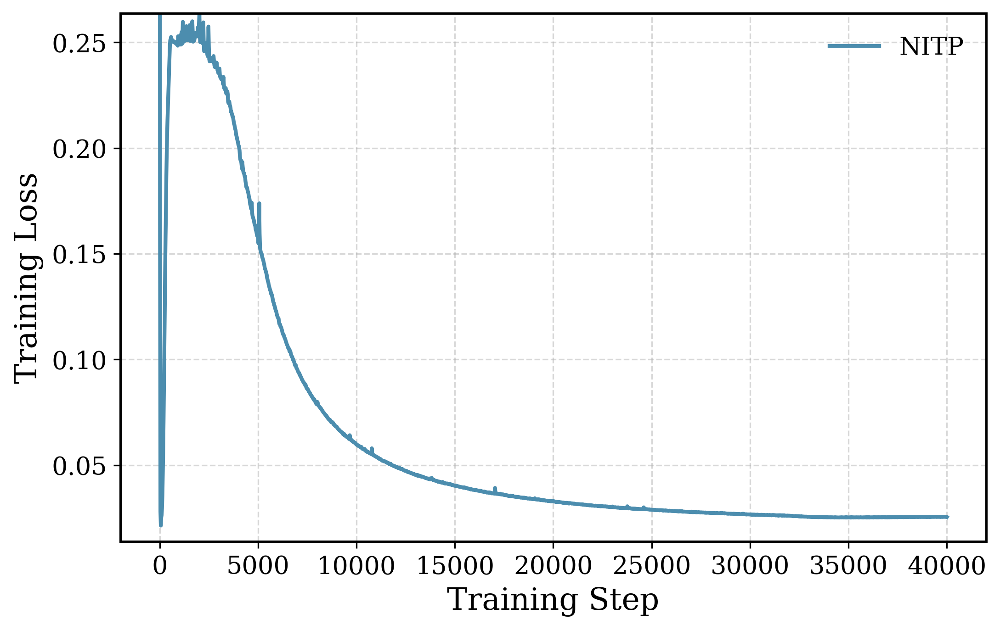
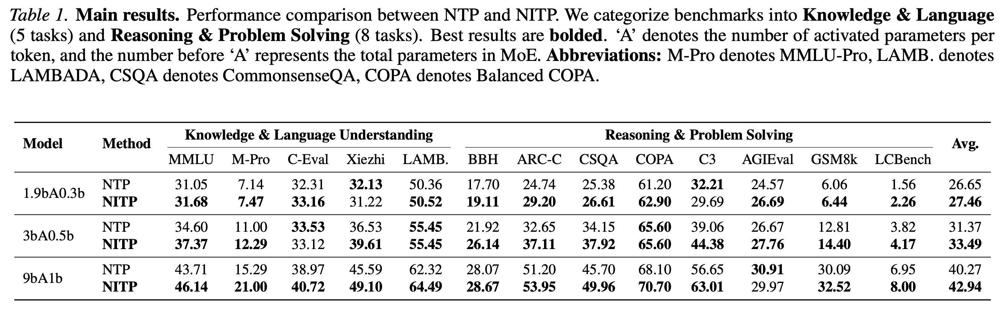
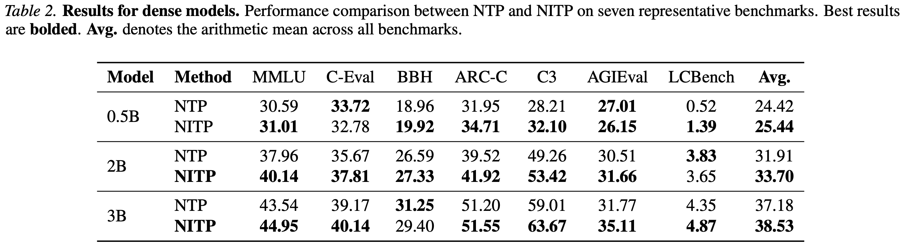

<div align="center">

# NITP: Next Implicit Token Prediction for LLM Pre-training

Xiangdong Zhang · Debing Zhang · Shaofeng Zhang · Xiaohan Qin · Yu Cheng · Junchi Yan

**ICML 2026**

[Paper](https://arxiv.org/abs/2605.24956) · [Citation](#citation)

</div>

## 📰 News

- **May 2026:** NITP was accepted to **ICML 2026**.
- **May 2026:** The paper is available on [arXiv](https://arxiv.org/abs/2605.24956).
- **Coming soon:** We will release the NITP implementation code.

## 🔍 Introduction

> Next token prediction defines what to predict, but fails to supervise how predictions are represented.

Next-token prediction (NTP) is the standard objective for language-model pre-training, but it supervises hidden states only through the final token-level likelihood. As a result, many degrees of freedom in the representation space remain weakly constrained: two models can obtain similar validation loss while learning hidden states with very different geometry and transferability.

**Next Implicit Token Prediction (NITP)** augments NTP with a lightweight representation-level objective. Instead of predicting only the discrete identity of the next token, NITP also asks the final hidden state to predict the next token's **implicit token**, defined as a shallow-layer contextual representation from the same model. This provides dense self-supervision in the latent space while preserving the original autoregressive training objective.

## ⚙️ Method

<p align="center">
  
</p>

NITP keeps the standard next-token prediction loss and adds a cosine-alignment loss between:

- the projected final hidden state at position `t`, and
- the stop-gradient shallow-layer representation of token `t+1`.

The total objective is:

```math
\mathcal{L}_{\mathrm{total}}
= \mathcal{L}_{\mathrm{NTP}}
+ \lambda \mathcal{L}_{\mathrm{NITP}}.
```

The implicit targets are produced during the same forward pass, so NITP does not require external encoders, extra data, or additional backbone forward passes. The projection head is used only during training and is discarded at inference time.

## 📈 Representation Dynamics

<p align="center">
  
</p>

NITP improves the geometry of hidden states during pre-training. Compared with NTP, it maintains a higher effective rank, reduces excessive cosine alignment measured from the last hidden states, and yields stronger benchmark trajectories for both MoE and dense models.

## 📉 NITP Loss Dynamics

<p align="center">
  
</p>

The NITP loss shows a stable three-phase training pattern: an initial rapid drop from random initialization, a transient rise as shallow-layer representations become more structured, and a long-term convergence phase where deeper hidden states learn to predict the implicit-token targets.

## 📊 Results

### Main Evaluation

<p align="center">
  
</p>

Across MoE models from 1.9B-A0.3B to 9B-A1B, NITP consistently improves downstream performance. On the 9B-A1B MoE model, NITP improves the average score from **40.27** to **42.94**, with notable gains on MMLU-Pro, C3, CommonsenseQA, ARC-Challenge, and GSM8k.

### Dense Models

<p align="center">
  
</p>

NITP also improves dense models from 0.5B to 3B parameters, showing that the method is not tied to MoE architecture.

### Pre-trained Representation Quality

To directly evaluate hidden-state quality, we freeze the 3B MoE models and evaluate mean-pooled last-layer representations on 25 English MTEB tasks without fine-tuning, contrastive training, or task-specific adaptation.

| Task group | NTP | NITP | Delta |
| --- | ---: | ---: | ---: |
| Classification | 47.77 | **49.97** | +2.20 |
| STS / Similarity | 40.73 | **43.66** | +2.93 |
| Retrieval / Duplicate detection | 18.50 | **20.14** | +1.64 |
| **Overall** | 39.24 | **41.56** | **+2.32** |

NITP improves 23 out of 25 MTEB tasks, indicating that the gains come from stronger hidden-state representations rather than only from changes in the output head.

## ⚡ Efficiency

NITP is lightweight during training and free at inference:

- **Training FLOPs overhead:** approximately 2.3% in the 9B MoE setting.
- **Wall-clock overhead:** approximately 1.8% over a 5k-step 9B MoE run.
- **Inference overhead:** zero, since the projection head is discarded after pre-training.


## Citation

```bibtex
@misc{zhang2026nitpimplicittokenprediction,
      title={NITP: Next Implicit Token Prediction for LLM Pre-training}, 
      author={Xiangdong Zhang and Debing Zhang and Shaofeng Zhang and Xiaohan Qin and Yu Cheng and Junchi Yan},
      year={2026},
      eprint={2605.24956},
      archivePrefix={arXiv},
      primaryClass={cs.CL},
      url={https://arxiv.org/abs/2605.24956}, 
}
```


## Contact

For questions or discussion, please contact Xiangdong Zhang at zhangxiangdong@sjtu.edu.cn.
